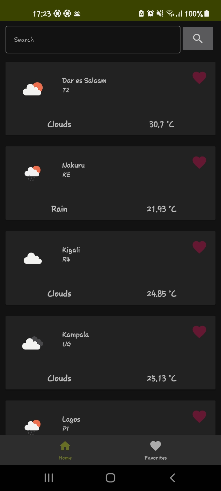
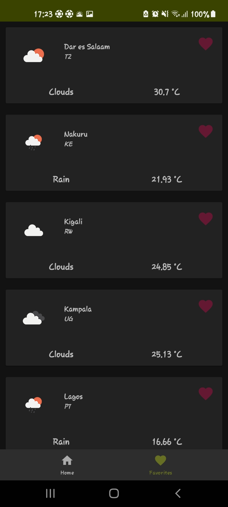
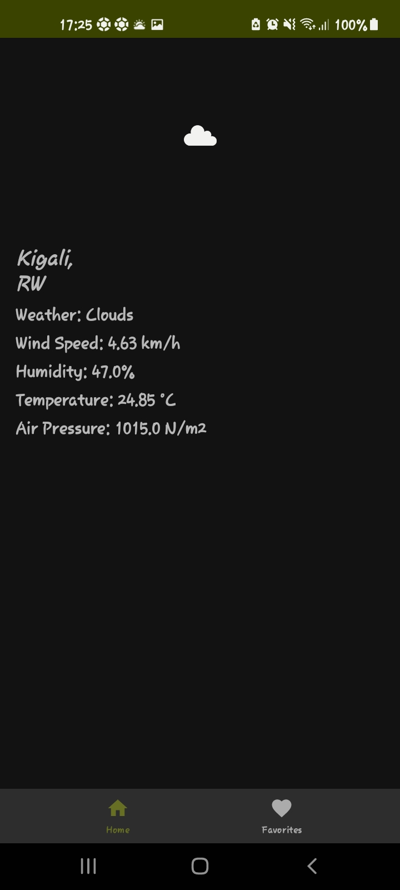

# TopUpWeather
TopUp weather is an application that consumes [OpenWeatherMap API](https://openweathermap.org/api)

The application has included [Clean Architecture by Uncle Bob](https://www.oreilly.com/library/view/clean-architecture-a/9780134494272/) that guides in separation of concerns for easier testing and debugging.

This is part of the Mobile Application Developer role at [TopUpMama](https://www.topupmama.com/)

## Tools
The application has been built using the following:

* The application has been built with the following:

    * [Kotlin](https://kotlinlang.org/)
    * [Coroutines](https://kotlinlang.org/docs/reference/coroutines-overview.html)
    * [Flow](https://kotlinlang.org/docs/reference/coroutines/flow.html)
    * [Jetpack](https://developer.android.com/jetpack)
        * [Lifecycle](https://developer.android.com/topic/libraries/architecture/lifecycle)
        * [ViewModel](https://developer.android.com/topic/libraries/architecture/viewmodel)
        * [WorkManager](https://developer.android.com/topic/libraries/architecture/workmanager)
        * [Room](https://developer.android.com/jetpack/androidx/releases/room)
        * [Navigation Component](https://developer.android.com/guide/navigation)
    * [Dagger-Hilt](https://dagger.dev/hilt/)
    * [Retrofit](https://square.github.io/retrofit/)

* Architecture
    * App Architecture - MVVM + Clean Architecture

* Tests
    * [JUnit5](https://junit.org/junit5/)
    * [Mockito](https://site.mockito.org/)
    * [Espresso](https://developer.android.com/training/testing/espresso)
    * [Hamcrest](http://hamcrest.org/)

## Screenshots
Take a peek at what am working on

MAIN SCREEN | FAVORITES SCREEN | DETAILS PAGE | SEARCH PAGE |
----------- | ----------- | ------------- |  ----------- |
 |  |  |  |

## SET UP
 * In order to run the app, you need to get an API key from [OpenWeatherMap API](https://openweathermap.org/api)
 * Create a file inside ``common`` called ```Api.Kt```
 * In the file add the following:
        
        object Api { const val KEY = "KEY_HERE"}

## LICENSE
This project is distributed under Apache License 2.0